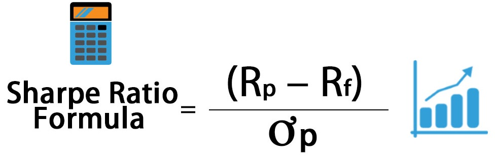

# S&P500 Portfolio Optimization
Using machine learning to optimize the S&P 500 and create balanced risk controled protfolios.

---

## Project Objectives

Develope Trading & Portfolio management strategies that offer elevated risk adjusted returns vs their benchmark, the S&P 500. Fund advisor are always seeking ways to beat their benchmarks. Often times advisors will turn to more risky investments in hopes of finding excess returns. While this may lead an advisor to outperform thier benchmark, it was accomplished through excessive risk.

The following strategy is not necessarily designed to beat the S&P 500, but rather to provide a strong risk adjusted return. We measure this return using the Sharpe Ratio.


We accomplish this using 2 different strategies
### S&P 500 Optimization Strategy:
The S&P 500 Optimization Strategy takes a 6 month lookback at the performance of the S&P 500 stocks. It then calculate the most optimal portfolio by adjusting the weights of each stock until the sharpe ratio for that period has been maximized. The strategy is reblanced on a monthly basis and individual stock weights are rebalanced between 0%-5%. In addition, volatility is limited so as not to exceed the S&P.
### Predictive Sector ETF Strategy:
The predictive ETF portfolio strategy utilizes predictive machine learning. Using 20 years of historical stock and economic data, the monthly returns for 11 ETFs (representing S&P 500 market sectors) are predicted. These predictions are then used to calculate the most efficent portfolio by finding the optimal portfolio weights, which will maximize the portfolio's sharpe ratio. The strategy is reblanced on a monthly basis and individual ETF weights are rebalanced between 1%-40%. In addition, volatility is limited so as not ot exceed the S&P 500.

### Inputs:
+ FRED Economic Variables
+ Key market ratios
+ Neural Networs and Scipcy Minimize

Using the above inputs, we will aim to provide a greater risk adjusted return than the general market.

---

## Installation

This application was run using Windows 10.

This project leverages Python 3.8.0 with the following packages:

+ pandas == 1.5.0
+ pandas-datareader == 0.9.0
+ pandas-market-calendars == 4.1.4
+ numpy == 1.23.5
+ datetime == 5.1
+ tensorflow == 2.11.0
+ matplotlib == 3.5.3
+ yfinance == 0.2.9
+ requests == 2.28.2
+ scikit-learn == 1.1.3
+ streamlit == 1.18.1
+ scipy == 1.9.3


### Installation Guide (Windows)

1.  Open a terminal or command prompt on your computer.
2.  Install all packages by running the commands: 

```bash
  pip install pandas==1.5.0
  pip install pandas-datareader==0.9.0
  pip install pandas-market-calendars==4.1.4
  pip install numpy==1.23.5
  pip install datetime==5.1
  pip install scikit-learn==1.1.3 
  pip install tensorflow==2.11.0
  pip install matplotlib==3.5.3
  pip install yfinance==0.2.9
  pip install requests==2.28.2
  pip install streamlit==1.18.1
```
3. In your terminal run the following code to copy the repository:
```bash
  git clone https://github.com/MrWho2u/Portfolio_Optimizer
```
4. In your terminal navigate to the "Portfolio_Optimizer" folder. Run the following application to open the streamlit app
```bash
  streamlit run stream_app.py
```

## Background Modules
In the background several modules run to provide our models. 

vix_mod
>This plugin pulls historical vix data and pricing. Uses kmeans to label vix data as "high," "medium," and "low" volatility.

spy_mod
>This plugin pulls historical SPDR S&P 500 ETF Trust (SPY) data and generates market indicators and financial ratios.

econ_mod
>This plugin pulls economic data from the Federal Reserve Economic Data.

sent_mod
>This plugin pulls news headlines for the SPY and groups them by day. It then performs sentiment analysis to give a sentiment score betweeo -1 and 1 (-1 being most negative and 1 being most positive)

create_train_test_mod
>This module pulls the data gathered from the vix_mod, spy_mod, econ_mod and sent_mod and compiles them into a single table. In addition it also prepares the X and y tables needed for training and testing

train_scaled_mod
>This module scales the training data.

test_scaled_mod
>This module scales the testing data.

nn_model_mod
>This module call forth a neural network regression model. This model is trained and fit using the scaled training data. Due to the inconsistancy of nueral network models, the models are set in loops, which will end when certain training requirements are met.

nn_class_model_mod
>This module call forth a neural network classification model. This model is trained and fit using the scaled training data. Due to the inconsistancy of nueral network models, the models are set in loops, which will end when certain training requirements are met.
---

## Summary

Regardless of whether a regression or classification neural network model is used, the model often outperformed during times of high volatility.

### Investment Strategy
Both models use the idology that if an "up" day is predicted, the strategy is invested in 100% SPY, and if a "down" day is predicted, the portfolio is shorted at -50%. As a result, days where both models predict a downturn the portfolio takes a 100% short position. Days where the both models predict an "up" day the portfolio is leveraged at 100%, for 2x the return of SPY. When the models conflit the portfolio takes a defensive stance at a 50% exposure to SPY.

### Keras Regression Model


### Keras Classifier Model


---

## Contributors

* Michael Roth
* Diego Favela
* Jonny Cruz

---

## License
This program is licensed under the MIT License.
