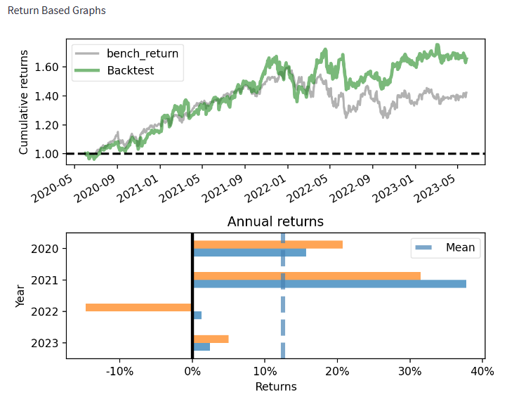
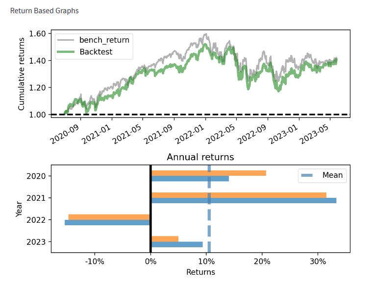

# S&P500 Portfolio Optimization
Using machine learning to optimize the S&P 500 and create balanced risk controled protfolios.

---

## Project Objectives

Develope Trading & Portfolio management strategies that offer elevated risk adjusted returns vs their benchmark, the S&P 500. Fund advisor are always seeking ways to beat their benchmarks. Often times advisors will turn to more risky investments in hopes of finding excess returns. While this may lead an advisor to outperform thier benchmark, it was accomplished through excessive risk.

The following strategy is not necessarily designed to beat the S&P 500, but rather to provide a strong risk adjusted return. We measure this return using the Sharpe Ratio.


We accomplish this using 2 different strategies
### S&P 500 Optimization Strategy:
The S&P 500 Optimization Strategy takes a 6 month lookback at the performance of the S&P 500 stocks. It then calculate the most optimal portfolio by adjusting the weights of each stock until the sharpe ratio for that period has been maximized. The strategy is rebalanced on a monthly basis and individual stock weights are rebalanced between 0%-5%. In addition, volatility is limited so as not to exceed the S&P.
### Predictive Sector ETF Strategy:
The predictive ETF portfolio strategy utilizes predictive machine learning. Using 20 years of historical stock and economic data, the monthly returns for 11 ETFs (representing S&P 500 market sectors) are predicted. These predictions are then used to calculate the most efficient portfolio by finding the optimal portfolio weights, which will maximize the portfolio's sharpe ratio. The strategy is rebalanced on a monthly basis and individual ETF weights are rebalanced between 1%-40%. In addition, volatility is limited so as not to exceed the S&P 500.

### Inputs:
+ FRED Economic Variables
+ Key market ratios
+ Neural Networs and Scipcy Minimize

Using the above inputs, we will aim to provide a greater risk adjusted return than the general market.

---

## Installation

This application was run using Windows 10.

This project leverages Python 3.8.0 with the following packages:

+ pandas == 1.5.0
+ pandas-datareader == 0.9.0
+ pandas-market-calendars == 4.1.4
+ numpy == 1.23.5
+ datetime == 5.1
+ tensorflow == 2.11.0
+ matplotlib == 3.5.3
+ yfinance == 0.2.9
+ requests == 2.28.2
+ scikit-learn == 1.1.3
+ streamlit == 1.18.1
+ scipy == 1.9.3
+ pyfolio == 0.9.2


### Installation Guide (Windows)

1.  Open a terminal or command prompt on your computer.
2.  Install all packages by running the commands:
    (Note: Python pyfolio package currently has a bug, you'll need to load directly from thier github where corrections have been made)

```bash
  pip install pandas==1.5.0
  pip install pandas-datareader==0.9.0
  pip install pandas-market-calendars==4.1.4
  pip install numpy==1.23.5
  pip install datetime==5.1
  pip install scikit-learn==1.1.3 
  pip install tensorflow==2.11.0
  pip install matplotlib==3.5.3
  pip install yfinance==0.2.9
  pip install requests==2.28.2
  pip install streamlit==1.18.1
  pip install git+https://github.com/quantopian/pyfolio
```
3. In your terminal run the following code to copy the repository:
```bash
  git clone https://github.com/MrWho2u/Portfolio_Optimizer
```
4. In your terminal navigate to the "Portfolio_Optimizer" folder. Run the following application to open the streamlit app
```bash
  streamlit run stream_app.py
```

## Background Modules
In the background several modules run to provide our models. 

initital_data_load
>This module pulls the all the required data and loads it into csv files that can be pulled later. Because loading large API files can be time consuming we have chosen to load files into csv files. We then implemented an if statement that checks to see if the files have been updated for the day. If they have then there is no need to run the APIs again.

econ_mod
>This plugin uses the FRED database to pull historical economic indicators. These indicators are then saved to a csv, so that they can later be pulled more easily. Further on, these indicators are merged with the ETF returns and used to train our predictive model.

get_etfs_mod
>This plugin pulls etf values for 11 etfs. A loop is then run to create several columns used for our machine learning model.

etf_reg_model
>This plugin houses the nueral network machine learning model used to predict the returns of the sector ETFs. It uses data from FRED and fundemental stock performance analysis.

etf_strategy_loop
>This plugin gathers all the respective ETF, economic data and the machine learning model. It then runds the model through a loop appending the results to a return table, which is used to calculate the holdings and returns for our strategy. 

sh_optimizer & sh_optimizer_etf
> These are function that get entered into scripy to optimize the portfolio's sharpe ratio. Two different functions are created because the parameters change slight between the S&P 500 stock model and the ETF model.

Optimizer_strategy_loop
> This function runs teh sh_optimizer funtion through a loop. This is the basis that allows us to rebalance the portfolio on a monthly basis. 

## Summary

Both strategies over a 3 year time period begin to outperform the S&P 500 on both a return and risk adjusted return basis. Because both strategies use a historical risk correlation view, it is more difficult than expected to keep volatility in check. Specifically with the ETF strategy, the 11 sectors are highly correlated with the general market. In order to further reduce risk and increase diversification a fixed income / risk free asset asset would need to be added to the portfolio. However, both strategies were able to provide a better sharpe ratio than the S&P500 over a 3 year period.

### S&P 500 Optimization Model



### ETF Predictive Model



## Next Steps
Give the available time and rescourse for this project we recogonize that major bias was overlook. The data is subject to servirorship bias. The S&P 500 Optimizer strategy uses current S&P500 stocks, because of this we are excluding stocks that may have been dropped due to poor performance. 

We have looked into adding these stocks but historical data for delisted stocks is limited. We recognize this is a current limitation and shortcoming. 

---

## Contributors

* Michael Roth
* Diego Favela

---

## License
This program is licensed under the MIT License.
